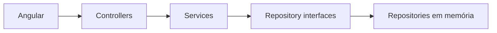

# FAST Workshops

Aplicação FullStack para cadastrar workshops, colaboradores e atas de presença e consultar a participação nos workshops trimestrais da FAST Soluções.

## Arquitetura

O backend é um único projeto ASP.NET Core MVC. Não utiliza Clean Architecture. O Angular fornece a interface web e consome a API JSON.



Responsabilidades e estrutura completa: [docs/ARCHITECTURE.md](docs/ARCHITECTURE.md).

## Pré-requisitos

- SDK .NET LTS definido por `global.json`;
- Node.js na versão definida pelo frontend;
- npm;
- Bash para os scripts de automação.

Nenhuma credencial, banco de dados ou configuração manual é necessária.

## Setup

Prepare as dependências de maneira idempotente:

```bash
./scripts/setup.sh
```

O comando pode ser executado novamente sem exigir limpeza manual.

## Execução

Backend:

```bash
dotnet run --project backend/Fast.Workshops.Api
```

Frontend, em outro terminal:

```bash
npm --prefix frontend start
```

A URL da API deve ser definida pelos arquivos de ambiente do Angular. A origem local do frontend deve corresponder à configuração CORS de desenvolvimento da API.

## Validação

Execute toda a validação, sem interação:

```bash
./scripts/check.sh
```

O script verifica formatação, build, lint e testes dos dois projetos. Consulte [docs/TESTING.md](docs/TESTING.md) para testes focados e regras de isolamento.

## Contratos

Os endpoints, payloads, validações e respostas de erro estão em [docs/API.md](docs/API.md).

## Escopo

Esta entrega usa armazenamento em memória. Banco de dados, autenticação, autorização, Swagger/OpenAPI e gráficos não fazem parte do escopo.
