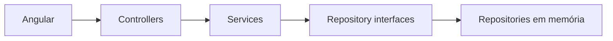

# FAST Workshops

Aplicação FullStack para cadastrar workshops, colaboradores e atas de presença e consultar a participação nos workshops trimestrais da FAST Soluções.

## Arquitetura

O backend é um único projeto ASP.NET Core MVC. Não utiliza Clean Architecture. O Angular fornece a interface web e consome a API JSON.



Responsabilidades e estrutura completa: [docs/ARCHITECTURE.md](docs/ARCHITECTURE.md).

## Pré-requisitos

- SDK .NET 10 LTS (`global.json` aceita os feature bands instalados de 10.0);
- Node.js 24 (`frontend/.nvmrc` e `frontend/package.json`);
- npm;
- Bash ou, no Windows, PowerShell 5.1 ou superior para os scripts de automação.

Nenhuma credencial, banco de dados ou configuração manual é necessária.

## Setup

Prepare as dependências de maneira idempotente:

```bash
./scripts/setup.sh
```

No Windows, execute no PowerShell:

```powershell
.\scripts\setup.ps1
```

O comando pode ser executado novamente sem exigir limpeza manual.

## Execução

Backend:

```bash
dotnet run --project backend/Fast.Workshops.Api
```

Frontend, em outro terminal:

```bash
npm --prefix frontend start
```

Acesse [http://localhost:4200](http://localhost:4200). A API roda em [http://localhost:5000/api/atas](http://localhost:5000/api/atas).

O frontend usa Angular 21, componentes standalone e testes Vitest pelo builder oficial do Angular. A URL da API está em `frontend/src/environments/environment.ts`. A origem CORS está em `backend/Fast.Workshops.Api/appsettings.json` e permite somente `http://localhost:4200` por padrão.

O perfil local do backend ativa `Development` e cria três workshops, quatro colaboradores e três atas com participações variadas. Os dados permanecem em memória e são reiniciados quando o backend encerra. Fora de `Development`, o armazenamento começa vazio.

Na interface, filtre atas por workshop, data e colaborador e abra os detalhes de um encontro. Os filtros ficam na URL e são preservados ao voltar. Nos detalhes, use Remover ao lado do participante para removê-lo da ata; seu cadastro permanece intacto. Os detalhes vêm da consulta de atas. Cadastros e inclusão de participantes continuam disponíveis pelos endpoints documentados em `docs/API.md`.

## Validação

Execute toda a validação, sem interação:

```bash
./scripts/check.sh
```

ou

```powershell
.\scripts\check.ps1
```

O script verifica formatação, build, lint e testes dos dois projetos. Consulte [docs/TESTING.md](docs/TESTING.md) para testes focados e regras de isolamento.

No Windows, os scripts `.ps1` usam `npm.cmd`. Para executar os `.sh`, use Git Bash com .NET e Node no PATH; o WSL requer suas próprias instalações de .NET e Node. Encerre os servidores de desenvolvimento antes do setup e da validação para evitar arquivos bloqueados no Windows.

## Contratos

Os endpoints, payloads, validações e respostas de erro estão em [docs/API.md](docs/API.md).

## Escopo

Esta entrega usa armazenamento em memória. Banco de dados, autenticação, autorização, Swagger/OpenAPI e gráficos não fazem parte do escopo.
