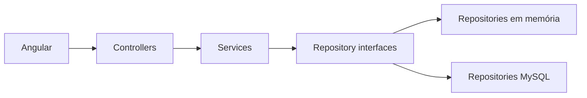

# FAST Workshops

Aplicação FullStack para cadastrar workshops, colaboradores e atas de presença e consultar a participação nos workshops trimestrais da FAST Soluções.

## Arquitetura

O backend é um único projeto ASP.NET Core MVC. Não utiliza Clean Architecture. O Angular fornece a interface web e consome a API JSON.



Responsabilidades e estrutura completa: [docs/ARCHITECTURE.md](docs/ARCHITECTURE.md).

## Pré-requisitos

- SDK .NET 10 LTS (`global.json` aceita os feature bands instalados de 10.0);
- Node.js 24 (`frontend/.nvmrc` e `frontend/package.json`);
- npm;
- Bash ou, no Windows, PowerShell 5.1 ou superior para os scripts de automação.

O modo memória não exige banco ou credenciais. Para MySQL e validação completa, instale Docker com containers Linux e mantenha o daemon em execução.

## Setup

Prepare as dependências de maneira idempotente:

```bash
./scripts/setup.sh
```

No Windows, execute no PowerShell:

```powershell
.\scripts\setup.ps1
```

O comando pode ser executado novamente sem exigir limpeza manual.

## Execução

Backend:

```bash
dotnet run --project backend/Fast.Workshops.Api
```

Frontend, em outro terminal:

```bash
npm --prefix frontend start
```

Acesse [http://localhost:4200](http://localhost:4200). A API roda em [http://localhost:5000/api/atas](http://localhost:5000/api/atas).

Com o backend em `Development` (perfil local padrão), acesse o [Swagger UI](http://localhost:5000/swagger) para consultar e executar os endpoints. O [documento OpenAPI](http://localhost:5000/swagger/v1/swagger.json) é gerado a partir dos controllers. Operações executadas pelo Swagger alteram o mesmo armazenamento usado pelo frontend.

O frontend usa Angular 21, componentes standalone e testes Vitest pelo builder oficial do Angular. A URL da API está em `frontend/src/environments/environment.ts`. A origem CORS está em `backend/Fast.Workshops.Api/appsettings.json` e permite somente `http://localhost:4200` por padrão.

No modo `InMemory`, o perfil local ativa `Development` e cria três workshops, quatro colaboradores e três atas com participações variadas. Os dados são reiniciados quando o backend encerra. Fora de `Development`, a memória começa vazia. O modo `MySql` não executa esse seed.

Na interface, filtre atas por workshop, data e colaborador e abra os detalhes de um encontro. Os filtros ficam na URL e são preservados ao voltar. Nos detalhes, use Remover ao lado do participante para removê-lo da ata; seu cadastro permanece intacto. Os detalhes vêm da consulta de atas. Cadastros e inclusão de participantes continuam disponíveis pelos endpoints documentados em `docs/API.md`.

## MySQL com Docker Compose

1. Copie `.env.example` para `.env` e substitua as duas senhas.
2. Execute `docker compose up -d --wait`. O serviço usa `mysql:latest`, porta local 3306 (alterável por `MYSQL_PORT`) e volume nomeado `mysql_data` montado em `/var/lib/mysql`.
3. Configure a conexão da API com a mesma senha de `MYSQL_PASSWORD`:

```bash
dotnet user-secrets set "ConnectionStrings:Workshops" "Server=localhost;Port=3306;Database=workshops;User=workshops;Password=SUA_SENHA" --project backend/Fast.Workshops.Api
```

4. Inicie a API com o provider selecionado:

```bash
dotnet run --project backend/Fast.Workshops.Api -- --Persistence:Provider=MySql
```

O Compose lê `.env`; a API usa a configuração nativa do .NET e não lê esse arquivo. User Secrets são carregados no ambiente `Development`. Em outros ambientes, injete `Persistence__Provider=MySql` e `ConnectionStrings__Workshops` no processo. A connection string não deve ser versionada.

O padrão em `appsettings.json` é `InMemory`. Para voltar explicitamente à memória, use `--Persistence:Provider=InMemory`. A troca exige reiniciar a API e não transfere dados entre modos. Configuração desconhecida, conexão ausente/inválida ou banco/schema indisponível impedem a inicialização. Falhas posteriores do MySQL não acionam fallback para memória.

O script `Repositories/MySql/schema.sql` cria as tabelas automaticamente somente quando o volume é inicializado pela primeira vez. Para um banco externo vazio, execute esse SQL no banco `workshops` antes de iniciar a API. Ele é idempotente para criação; mudanças futuras de schema precisam de scripts de migração explícitos.

`docker compose down` preserva os dados. `docker compose down -v` apaga o volume e os dados. Alterar senhas no `.env` não modifica usuários já criados no volume. A tag `latest` acompanha novas versões; faça backup e confira a compatibilidade do volume antes de atualizar a imagem.

Referências: [imagem oficial MySQL](https://hub.docker.com/_/mysql), [provider MySQL para EF Core](https://www.nuget.org/packages/MySql.EntityFrameworkCore/10.0.9).

## Validação

Execute toda a validação, sem interação:

```bash
./scripts/check.sh
```

ou

```powershell
.\scripts\check.ps1
```

O script verifica formatação, build, lint e testes dos dois projetos. Consulte [docs/TESTING.md](docs/TESTING.md) para testes focados e regras de isolamento.

No Windows, os scripts `.ps1` usam `npm.cmd`. Para executar os `.sh`, use Git Bash com .NET e Node no PATH; o WSL requer suas próprias instalações de .NET e Node. Encerre os servidores de desenvolvimento antes do setup e da validação para evitar arquivos bloqueados no Windows.

## Contratos

Os endpoints, payloads, validações e respostas de erro estão em [docs/API.md](docs/API.md).

## Escopo

Esta entrega oferece armazenamento em memória e MySQL. Autenticação, autorização e gráficos não fazem parte do escopo.
